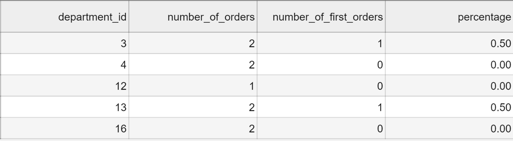
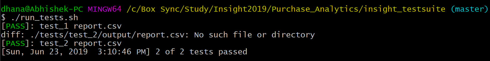

# INSIGHT DATA SCIENCE - Purchase Analytics 
## Coding Challenge, Abhishek Dhanasetty

Programming language used:
=================

 > Python 3.7.3

## Table of Contents:

1. Problem Statement
2. Introduction
3. Idea 
4. Testing
5. Results

### Problem Statement:

> For this challenge, I need to calculate, for each department, the number of times a product was requested, number of times a product was requested for the first time and a ratio of those two numbers.

### Introduction:

I have two input files `order_products.csv`, `products.csv` where,

 `order_products.csv` holds data on one request, and contains the fields, `order_id, product_id, add_to_cart, reordered` amoung which I am only considering product_id and reordered for my analysis. 
 
 `products.csv` holds information about every product, and contains the fields, `product_id, product_name, aisle_id, department_id` and in this input file I am only considering product_id and department_id`.
 
From the given input dataset, I am calculating the number of product requested and number of product requested for the first time.

### Idea:

1. First I am reading the products.csv file and I am creating a dictionary with `key: product_id` and `value:department_id`.
	> For the above dataset, the dictionary is:
		{9327: 13, 17461: 12, 17668: 16, 28985: 4, 32665: 3, 33120: 16, 45918: 13, 46667: 4, 46842: 3}

2. Then I am reading the order_products.csv file and I am creating a dictionary with `key: product_id -> department_id` (from the previously created dictionary and the `value: [reordered information]`.

	> {16: [1, 1], 4: [1, 1], 13: [0, 1], 12: [1], 3: [1, 0]}

3. Finally, I am storing the values such as department_id,number_of_orders,number_of_first_orders,percentage in report.csv.
	
	
		

### Testing

1. Testing the code using the given test suite.

    

### Results

The results are stored in the output folder as report.csv

Thank you.
